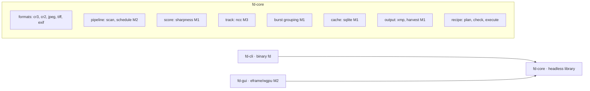
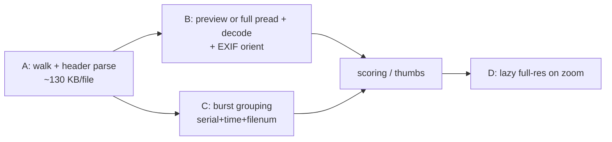
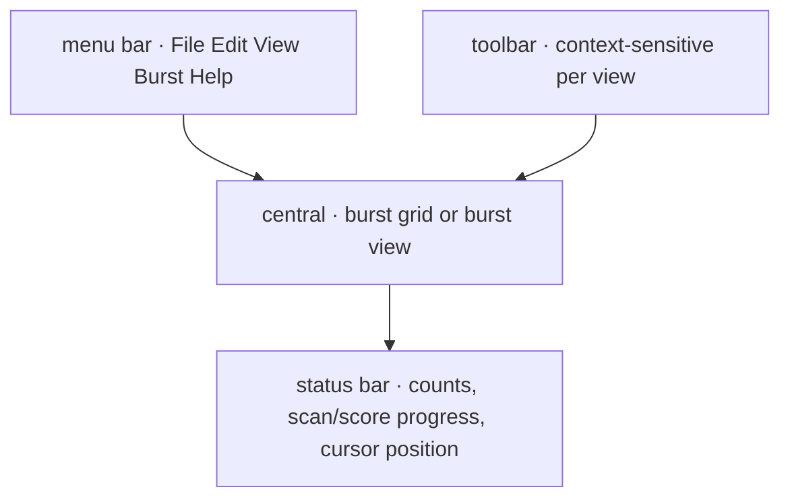
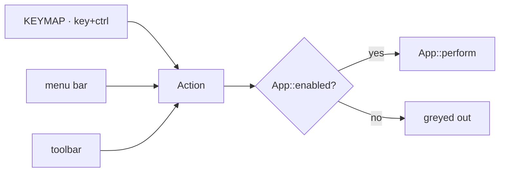
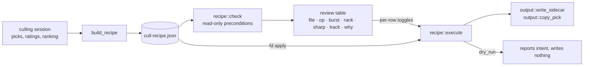

# Architecture

*Updated: 2026-09-08 (M0–M3 built; GUI control system, recipe harvest,
selectable image source, EXIF-upright display, camera eye points with
native-resolution pupil edge width. Remaining M4+ sections describe the
approved design).*

## Core principle

**Never decode RAW sensor data on the hot path.** Every Canon still format
embeds JPEGs sufficient for browsing, ranking and sharpness scoring:

| Format | Thumb | Preview | Full-size JPEG | Where |
|---|---|---|---|---|
| CR3 (ISO-BMFF) | `THMB` 160×120 | `PRVW` 1620×1080 | trak sample in `mdat` (native res) | offsets from `moov` (first ~256 KB) |
| CR2 (TIFF) | IFD1 | IFD0 strip (large) | — | offsets in first few KB |
| JPEG | — | itself | itself | — |
| HEIF (M4) | thumbnail item | — | — | `meta` box |

A 25 MB CR3 costs ~130 KB (header scan) + ~370 KB (preview) of I/O.
Measured on the reference corpus (5,540 R5 II files): 0.83 s full-card
header scan, 6,647 files/s.

`formats::Source` chooses which of these `extract_jpeg` hands out: `Embedded`
(preview, thumb fallback — the default) or `Full` (full-size JPEG, preview
fallback for CR2). Thumbnails always use `Embedded`, 100% zoom always `Full`;
the main preview, scores and tracks follow the engine's source. `Full` costs a
whole-file read plus a 1/4-scale DCT decode per image, so it is opt-in.

## Workspace layout

- `fd-core/src/io.rs` — `ReadRange` trait (the wasm/Vfs seam) + `FileReader`
  with cached header chunk and byte-count accounting.
- `fd-core/src/formats/tiff.rs` — endian-aware IFD walker shared by CR2,
  JPEG APP1 and CR3 `CMTx` boxes.
- `fd-core/src/formats/cr3.rs` — ISO-BMFF box walk: `moov` → Canon uuid
  (`CMT1` IFD0, `CMT2` ExifIFD, `THMB`, `CTBO`), trak tables for the
  full-size JPEG sample, `CTBO` entry 2 for the `PRVW` uuid byte range
  (parsed lazily at extraction via `locate_prvw_jpeg`).
- Timestamps: `DateTimeOriginal` + `SubSecTimeOriginal` → centiseconds
  (`Timestamp.unix_centis`); at 30 fps neighbors differ by 3–4 centis.

## Scan pipeline (stages stream; UI never waits)

A track runs in two phases: NCC positions stream first with the patch score
(`Event::TrackPoint`), then the native pupil measurements arrive together
(`Event::EyePoint`, `Event::TrackDone`) and the GUI switches the ranking to
eye widths only once the burst is complete, so a width is never sorted against
a patch score.

Decoded RGBA and the tracking luma are re-laid-out to EXIF orientation
(`decode::orient`, all eight cases) before they leave fd-core, so the GUI, the
click coordinates and the track points share one upright normalized space and
no coordinate transform exists anywhere. The global-score luma is left as
stored: max-over-tiles Tenengrad is orientation-neutral and this keeps old
cache entries valid. `FileMeta::display_dims` gives the swapped dimensions for
the 1:1 view.

Planned concurrency (M2): coordinator thread with priority job queue
(`Visible > NearViewport > ActiveBurst > Prefetch > Background`), separate
I/O pool (sized for card-reader latency, 8–16 in flight), rayon CPU pool,
single SQLite writer; cancellation via generation counter.

## Scoring & tracking (M1/M3)

- Sharpness (`score.rs`, `SCORE_VERSION` 2): mean squared 5-point Laplacian
  divided by luma variance (x100), single scale at the working resolution
  (~1620-2048 px). Chosen 2026-09-04 with `crates/fd-core/examples/sharpbench.rs`,
  which degrades real frames at native scale (Gaussian blur, common-mode noise,
  sub-pixel shift, exposure) and scores them at the app's working resolutions:
  a 2 px native blur is separated 2.0-3.6x where the previous Sobel/variance
  metric managed 1.13-1.22x (a 3x3 Sobel has no response at the band a
  downsampled fine blur lives in), sharp still beats blurred under heavy noise
  (1.2-1.4x), and the 16-frame owl burst's ROI scores spread 3.55x instead of
  1.10x. Measuring at native resolution was benchmarked and rejected: no better
  discrimination-to-jitter ratio, 3-10x the noise inflation, a decode per frame.
  `score_global` is the max over a 9x6 tile grid, center-weighted and gated by
  tile contrast (variance/400, capped at 1) so a flat noisy sky tile cannot win;
  the interim/fallback ROI score is the same formula on a 96/1620 patch
  around the point. Scores are cached under a key that carries `SCORE_VERSION`.
- Eye acuity (`eye.rs`, 2026-09-05): the ROI score that actually ranks a
  burst. Around the focus point the full-resolution JPEG is losslessly cropped
  (`decode::decode_luma_crop`, turbojpeg transform, ~0.25 s/frame, three
  frames at a time), the pupil is segmented (region grown from the darkest
  seed over rising thresholds, stopped before the first area jump and capped
  at half the eye box; solidity and aspect gates; retries from the next seed),
  and 64 rays across the rim give the 10-90% rise width; the score is the 75th
  percentile in native px (lower = sharper), p90/p50 above 1.6 flags motion blur. A
  burst's pupils must agree in radius (±40% of the median) or the frame keeps
  the patch score. The native-resolution *area* metric was rejected by the
  2026-09-04 benchmark; an edge width is a different quantity and needs native
  pixels.
- Focus points: the camera's Eye-AF frame (`formats/canon.rs`, Canon MakerNote
  AFInfo2, in JPG APP1 and CR3 CMT3; +Y up, stored orientation, mapped through
  `decode::orient_norm`) is an implicit pin on every frame where it is
  eye-sized (`FileMeta::af_box_eye`). The user's clicks are pins too
  (`TrackRequest.seeds`) and win on their frame. Frames with neither follow
  their nearest pin by pyramidal NCC (dual-template drift control, per-frame
  confidence). `TrackRequest.use_af` turns the camera pins off for a burst
  where Eye-AF tracked the wrong subject.
- Focus coverage and peaking (`eye::peaking_mask`, `eye::coverage`): one test,
  "gradient of the 3x3-smoothed luma above 8 levels/px", serves two purposes.
  `coverage` is the fraction of the focus area (the camera's eye box, or the
  search area around a pin) passing it at working resolution, sent with every
  `TrackPoint` and offered as a third sort mode; `decode::peaking_overlay`
  paints the same pixels red on previews and full-res frames when the display
  flag is on, so what lights up is exactly what the number counts. It is a
  texture measure, not an edge width, which is why the eye edge width stays
  the primary ranking score.

## Cache (M1)

SQLite (WAL, one writer thread): `files`, `thumbs`, `scores`, `bursts`,
`roi_tracks`, `decisions`. Key = `xxh3 of first 64 KB + size` — survives
remounts/drive letters — with a `-full` suffix for `Source::Full` scores, so
the two sources never mix. Reopen of a scanned card ≈ 1 s.

## GUI structure

Four panels around the content area. The menu bar is the complete inventory of
what the app can do; the toolbar is the frequent subset for the current view;
the status bar is the only place that reports state.

### One action layer

Keyboard, menu and toolbar are three routes to the same enum. `Action` is the
vocabulary, `App::perform` the only implementation, `App::enabled` the single
predicate deciding whether something applies right now — which is also what
greys out menu entries, so the menus advertise capabilities that are
momentarily unavailable rather than hiding them.

`KEYMAP` is data, not code, so a unit test can prove no key+modifier is bound
twice. Context-sensitivity (an arrow moves the grid cursor in Overview and the
frame in Burst) lives in `perform`, not in the binding table.

`View > Source` is the one setting that is not pure UI state: previews, scores
and tracks all derive from it, so `perform` reopens the folder with a fresh
`Engine` (the session is saved first, so flags survive).

Auto-brighten and focus peaking are display-only: two atomic flags on the
`Engine` that the decode worker applies to preview/full RGBA before upload
(`decode::auto_brighten`, `decode::peaking_overlay`); thumbnails, scores and
tracking luma never see them, so toggling them invalidates no cache.

## Outputs: the two-step harvest

Originals are never modified. Every edit goes through a **recipe**
(`fd-core/src/recipe.rs`) rather than being applied as the user clicks:

Each `PlannedAction` carries the evidence behind the decision — burst number,
rank within the burst, sharpness, ROI sharpness and tracker confidence, plus a
plain-language reason. That is what makes the automated steps auditable: the
user confirms the grouping and ranking detected what was intended *before* any
file is touched.

`execute` is the single writer for both the GUI and `fd apply`, and it only
ever calls the existing `output` helpers. `check` never writes. `Skip` rows are
part of the recipe so what is being left behind is reviewable too.

Nothing is ever deleted or moved. Rejects are only recorded, with flags,
ratings and manual pins, in `fd-session.json` (the one file the app writes
into the image folder). Rating sidecars go next to the copies by default;
writing them next to the originals is opt-in.
