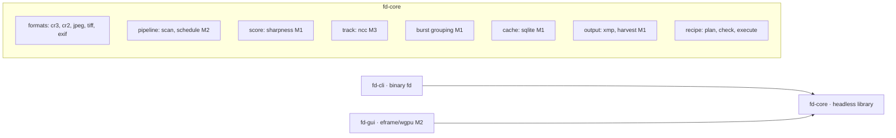
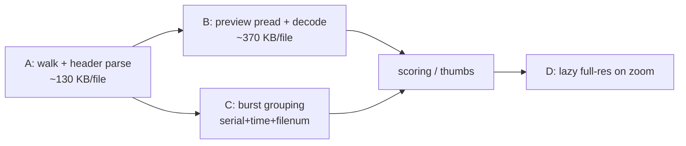
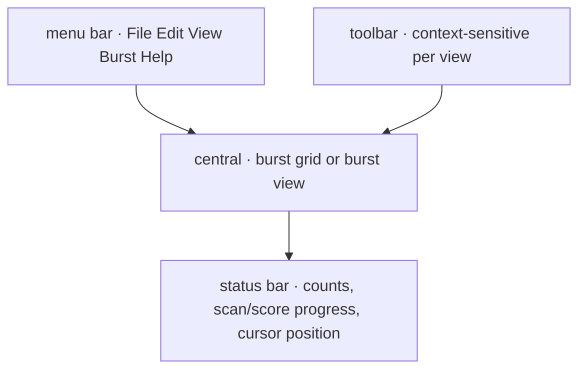
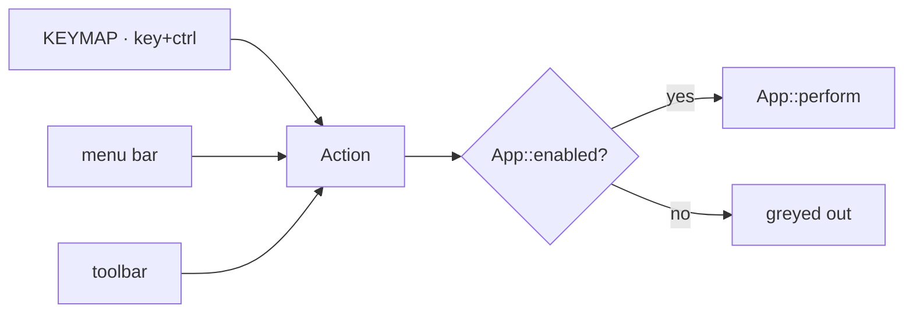
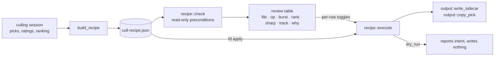

# Architecture

*Updated: 2026-08-03 (M0–M3 built; GUI control system and recipe harvest
added. Remaining M4+ sections describe the approved design).*

## Core principle

**Never decode RAW sensor data on the hot path.** Every Canon still format
embeds JPEGs sufficient for browsing, ranking and sharpness scoring:

| Format | Thumb | Preview | Full-size JPEG | Where |
|---|---|---|---|---|
| CR3 (ISO-BMFF) | `THMB` 160×120 | `PRVW` 1620×1080 | trak sample in `mdat` (native res) | offsets from `moov` (first ~256 KB) |
| CR2 (TIFF) | IFD1 | IFD0 strip (large) | — | offsets in first few KB |
| JPEG | — | itself | itself | — |
| HEIF (M4) | thumbnail item | — | — | `meta` box |

A 25 MB CR3 costs ~130 KB (header scan) + ~370 KB (preview) of I/O.
Measured on the reference corpus (5,540 R5 II files): 0.83 s full-card
header scan, 6,647 files/s.

## Workspace layout

- `fd-core/src/io.rs` — `ReadRange` trait (the wasm/Vfs seam) + `FileReader`
  with cached header chunk and byte-count accounting.
- `fd-core/src/formats/tiff.rs` — endian-aware IFD walker shared by CR2,
  JPEG APP1 and CR3 `CMTx` boxes.
- `fd-core/src/formats/cr3.rs` — ISO-BMFF box walk: `moov` → Canon uuid
  (`CMT1` IFD0, `CMT2` ExifIFD, `THMB`, `CTBO`), trak tables for the
  full-size JPEG sample, `CTBO` entry 2 for the `PRVW` uuid byte range
  (parsed lazily at extraction via `locate_prvw_jpeg`).
- Timestamps: `DateTimeOriginal` + `SubSecTimeOriginal` → centiseconds
  (`Timestamp.unix_centis`); at 30 fps neighbors differ by 3–4 centis.

## Scan pipeline (stages stream; UI never waits)

Planned concurrency (M2): coordinator thread with priority job queue
(`Visible > NearViewport > ActiveBurst > Prefetch > Background`), separate
I/O pool (sized for card-reader latency, 8–16 in flight), rayon CPU pool,
single SQLite writer; cancellation via generation counter.

## Scoring & tracking (M1/M3)

- Sharpness: Tenengrad + variance-of-Laplacian on luma, 3 pyramid scales,
  normalized by local RMS contrast; ROI patch from the tracked point, else
  max-over-tiles global score.
- Tracking: pyramidal NCC template match, bidirectional from the clicked
  frame, dual-template drift control, per-frame confidence; re-click adds a
  keyframe.

## Cache (M1)

SQLite (WAL, one writer thread): `files`, `thumbs`, `scores`, `bursts`,
`roi_tracks`, `decisions`. Key = `(size, mtime, xxh3 of first 64 KB)` —
survives remounts/drive letters. Reopen of a scanned card ≈ 1 s.

## GUI structure

Four panels around the content area. The menu bar is the complete inventory of
what the app can do; the toolbar is the frequent subset for the current view;
the status bar is the only place that reports state.

### One action layer

Keyboard, menu and toolbar are three routes to the same enum. `Action` is the
vocabulary, `App::perform` the only implementation, `App::enabled` the single
predicate deciding whether something applies right now — which is also what
greys out menu entries, so the menus advertise capabilities that are
momentarily unavailable rather than hiding them.

`KEYMAP` is data, not code, so a unit test can prove no key+modifier is bound
twice. Context-sensitivity (an arrow moves the grid cursor in Overview and the
frame in Burst) lives in `perform`, not in the binding table.

## Outputs: the two-step harvest

Originals are never modified. Every edit goes through a **recipe**
(`fd-core/src/recipe.rs`) rather than being applied as the user clicks:

Each `PlannedAction` carries the evidence behind the decision — burst number,
rank within the burst, sharpness, ROI sharpness and tracker confidence, plus a
plain-language reason. That is what makes the automated steps auditable: the
user confirms the grouping and ranking detected what was intended *before* any
file is touched.

`execute` is the single writer for both the GUI and `fd apply`, and it only
ever calls the existing `output` helpers. `check` never writes. `Skip` rows are
part of the recipe so what is being left behind is reviewable too.

Still planned (M4): rejects to OS trash, deletes running last so cancel is
clean.
